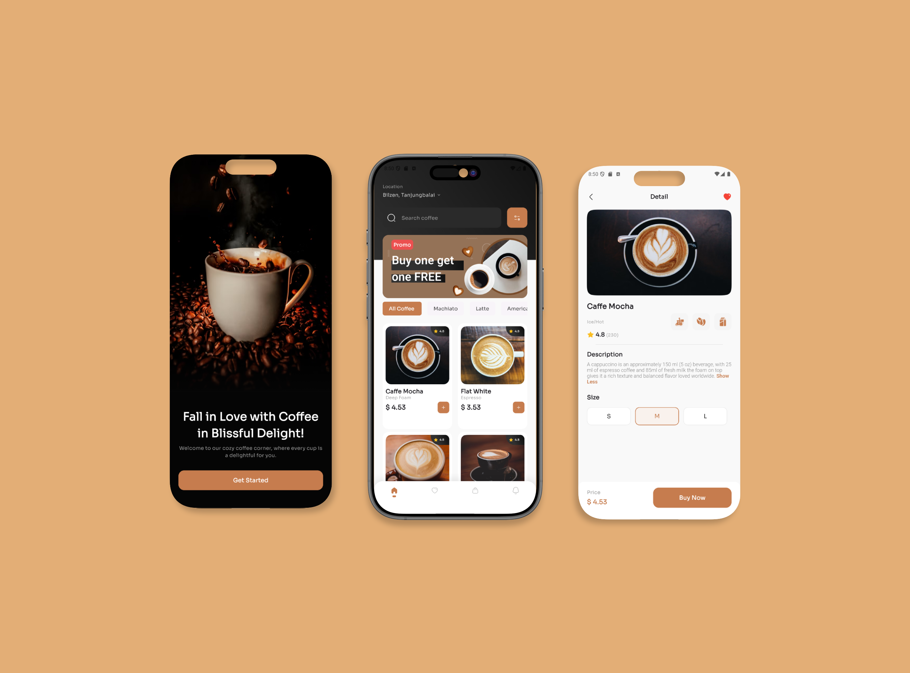
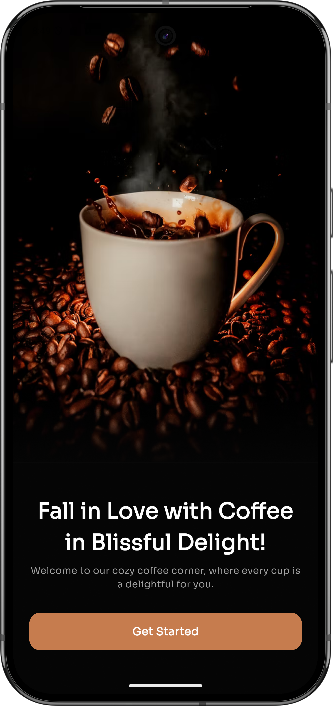
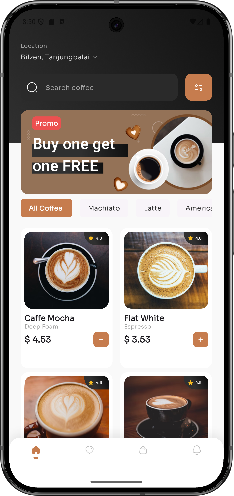
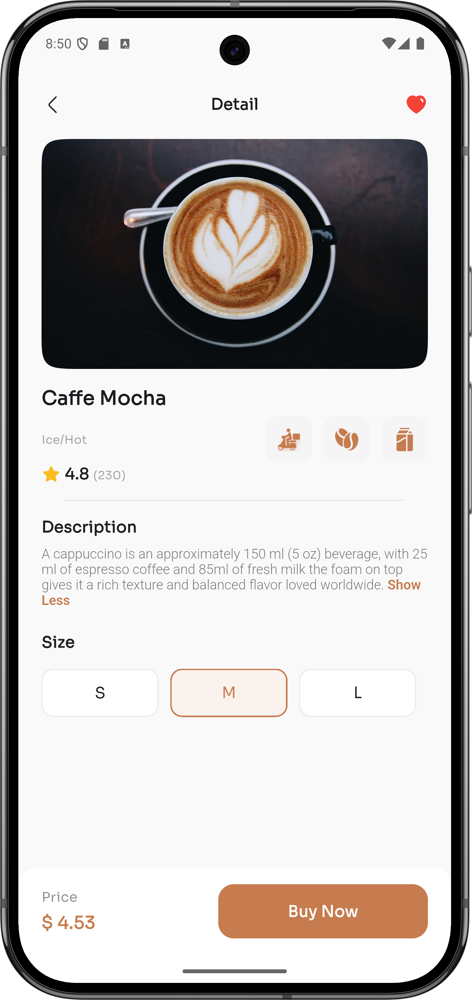
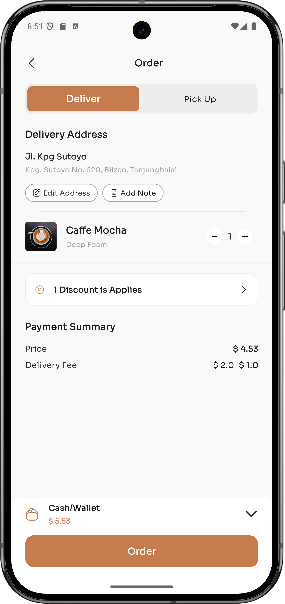
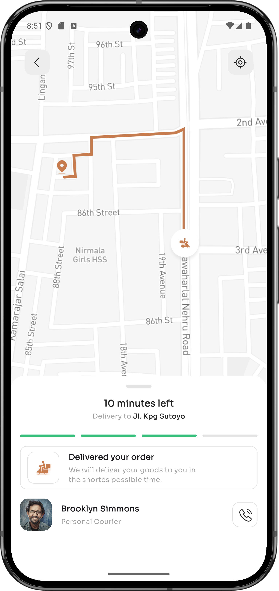

# coffee_shop_app

     
 
[Video Preview Here](https://www.youtube.com/watch?v=91buSVs78tA)


## 📝 Description

A sleek and modern coffee shop application developed using the Flutter framework to deliver a high-performance, cross-platform experience. This app allows users to browse a curated selection of beverages and manage their orders through an intuitive and visually appealing interface. Built with a focus on stability and code quality, the project incorporates robust testing features to ensure a seamless and bug-free user journey from beans to cup.



## 📸 Screenshots

| | | |
|:-:|:-:|:-:|
|  |  |  |
|  |  |  |

## 🎨 Design

You can view the UI/UX design here:  
[Figma Design File](https://www.figma.com/community/file/1116708627748807811)


## ✨ Features

- Home
- Order
- Delivery

## 🛠️ Tech Stack

- 💙 Flutter

## ⚡ Quick Start

```bash

# Clone the repository
git clone https://github.com/Nidhal-Khazene/coffee_shop_app.git

# Get packages and run
flutter pub get && flutter run
```

## 📦 Key Dependencies

```
name: coffee_shop_app
description: "A new Flutter project."
publish_to: 'none' # Remove this line if you wish to publish to pub.dev
version: 1.0.0+1
sdk: flutter
cupertino_icons: ^1.0.8
google_fonts: ^6.3.2
iconsax: ^0.0.8
flutter_svg: ^2.2.3
iconly: ^1.0.1
flutter_lints: ^5.0.0
uses-material-design: true
assets_path: assets/images/
output_path: lib/core/utils/
filename: assets.dart
```


## 📁 Project Structure

```
.
├── LICENSE
├── analysis_options.yaml
├── assets
│   ├── images
│   │   ├── coffee_1.png
│   │   ├── coffee_2.png
│   │   ├── coffee_3.png
│   │   ├── coffee_4.png
│   │   ├── coffee_details.png
│   │   ├── helper
│   │   │   ├── beans_icon.png
│   │   │   ├── delivery_icon.png
│   │   │   ├── filter_icon.svg
│   │   │   └── package_icon.png
│   │   ├── home_banner_promo.png
│   │   ├── map_with_deliver_location.png
│   │   ├── on_boarding_background_image.png
│   │   ├── person.png
│   │   └── whited_black_bg.png
│   └── previews
│       ├── 1.png
│       ├── 2.png
│       ├── 3.png
│       ├── 4.png
│       └── 5.png
├── coffee_shop_app.iml
├── lib
│   ├── core
│   │   ├── constants
│   │   │   └── constants.dart
│   │   ├── routes
│   │   │   └── on_generate_routes.dart
│   │   └── utils
│   │       ├── assets.dart
│   │       ├── colors.dart
│   │       └── styles.dart
│   ├── features
│   │   ├── delivery
│   │   │   └── presentation
│   │   │       └── views
│   │   │           ├── delivery_view.dart
│   │   │           └── widgets
│   │   │               ├── delivery_custom_app_bar.dart
│   │   │               ├── delivery_view_body.dart
│   │   │               └── driver_detail_bottom_view.dart
│   │   ├── home
│   │   │   ├── domain
│   │   │   │   └── entities
│   │   │   │       └── coffee_entity.dart
│   │   │   └── presentation
│   │   │       └── views
│   │   │           ├── coffee_details_view.dart
│   │   │           ├── home_view.dart
│   │   │           └── widgets
│   │   │               ├── category_chips.dart
│   │   │               ├── coffee_details_custom_app_bar.dart
│   │   │               ├── coffee_details_description.dart
│   │   │               ├── coffee_details_view_body.dart
│   │   │               ├── coffee_details_view_image.dart
│   │   │               ├── coffee_details_view_information.dart
│   │   │               ├── coffee_grid_view.dart
│   │   │               ├── coffee_item.dart
│   │   │               ├── coffee_item_image.dart
│   │   │               ├── coffee_purchase.dart
│   │   │               ├── custom_home_header.dart
│   │   │               ├── custom_home_search_bar.dart
│   │   │               ├── home_view_body.dart
│   │   │               ├── promo_card.dart
│   │   │               ├── promo_card_text_content.dart
│   │   │               └── size_selector.dart
│   │   ├── on_boarding
│   │   │   └── presentation
│   │   │       └── views
│   │   │           ├── on_boarding_view.dart
│   │   │           └── widgets
│   │   │               └── on_boarding_view_body.dart
│   │   └── order
│   │       └── presentation
│   │           └── views
│   │               ├── order_view.dart
│   │               └── widgets
│   │                   ├── order_cash_wallet.dart
│   │                   ├── order_delivery_address.dart
│   │                   ├── order_discount.dart
│   │                   ├── order_payment_summary.dart
│   │                   ├── order_switch_deliver_pick_up.dart
│   │                   ├── order_view_body.dart
│   │                   └── order_view_custom_app_bar.dart
│   ├── main.dart
│   └── shared
│       └── widgets
│           ├── cart_increment_decrement.dart
│           ├── custom_bottom_navigation_bar.dart
│           ├── custom_button.dart
│           ├── custom_divider.dart
│           └── custom_icon_container.dart
├── pubspec.yaml
└── test
    └── widget_test.dart
```

## 🛠️ Development Setup

### Flutter Setup
1. Install [Flutter SDK](https://flutter.dev/docs/get-started/install)
2. Run: `flutter pub get`
3. Start the app: `flutter run`

## 👥 Contributing

Contributions are welcome! Here's how you can help:

1. **Fork** the repository
2. **Clone** your fork: `git clone https://github.com/Nidhal-Khazene/coffee_shop_app.git`
3. **Create** a new branch: `git checkout -b feature/your-feature`
4. **Commit** your changes: `git commit -am 'Add some feature'`
5. **Push** to your branch: `git push origin feature/your-feature`
6. **Open** a pull request

Please ensure your code follows the project's style guidelines and includes tests where applicable.

## 📜 License

This project is licensed under the MIT License.

---
*This README was generated with ❤️ by [ReadmeBuddy](https://readmebuddy.com)*

